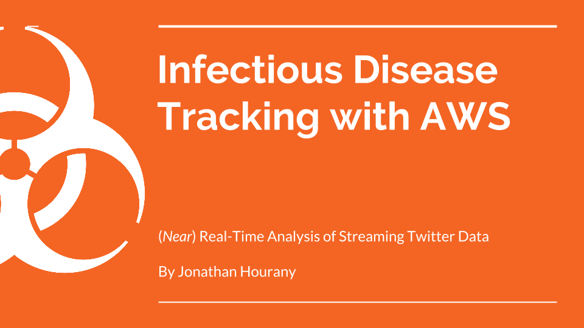

# 
## Disease Tracking with Twitter and AWS 
Inspired by [this XKCD](https://xkcd.com/723/) where Randall made the observation that it's concevable that people could be reading tweets about incoming sismic activity before it hits them, I tried to impliment a similar idea with injectious diseases. Using tweets about illness, could we track the velocity of disease spread and alert neighborhoods before an outbreak.

This project's primary goal was to construct a data pipeline from a real-time source that *could* feed a machine learning algorithm, *not* to actually train one. Of special note is that due to Twitter's API, streaming both tweets with certain hashtags *and* tweets that have geo location enabled, so I had to artifically impute geo location to each tweet in order to meet project requirments.

### Dependencies
* boto3
* Spark
* PySpark
* AWS
### The Pipeline
I used Python and Tweepy to connect to Twitters streaming API which I then fed into an AWK Firehose instance. The firehose would dump it's aggregated data once every 5 minutes, or 5 megabytes, which ever occured first. Spark was then used to churn through the tweets in a distributed fashion, with the results saved to a csv file.

